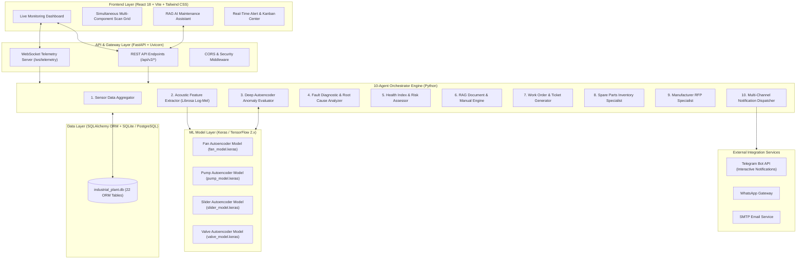
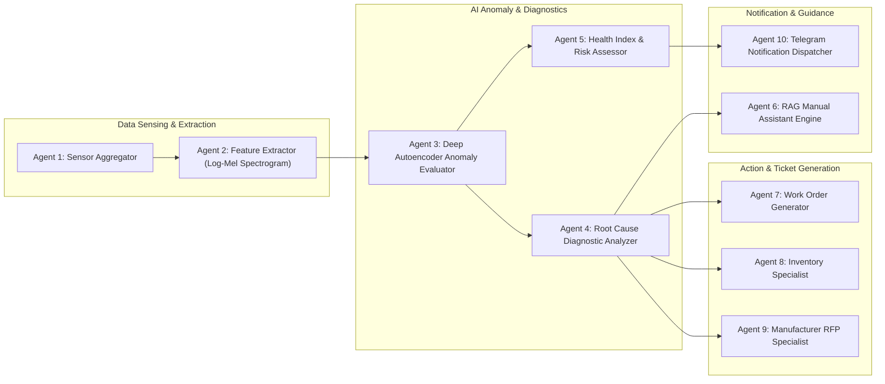
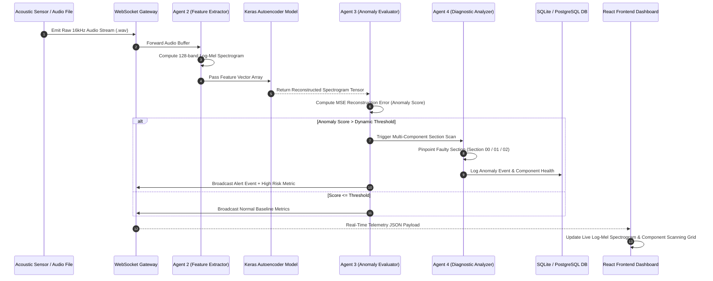
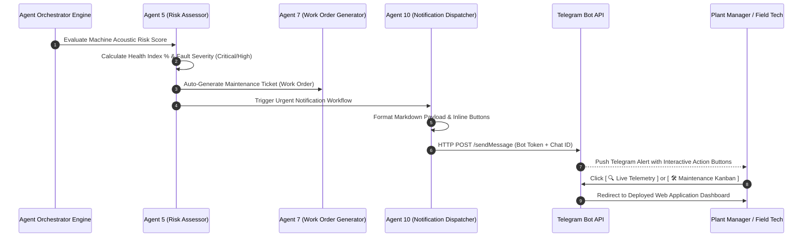
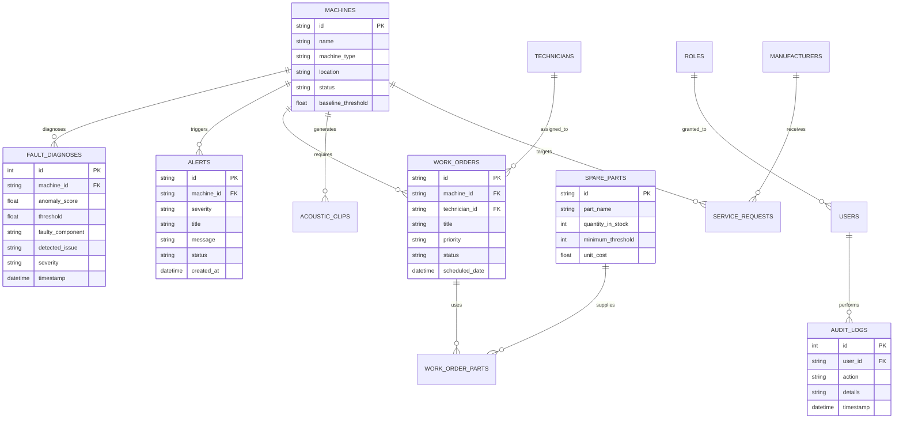
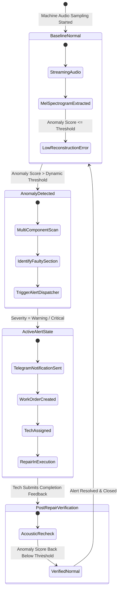
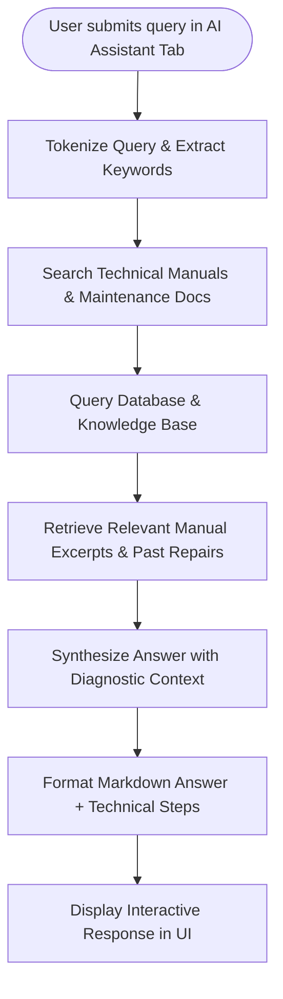

# System Architecture & Diagrams
## AI-Agent Based Intelligent Predictive Maintenance System Using Machine Sound Analysis

---

## 1. High-Level System Architecture Diagram

---

## 2. 10-Agent Orchestration Workflow Diagram

---

## 3. Real-Time Acoustic Telemetry & Anomaly Processing Sequence Diagram

---

## 4. End-to-End Fault Detection to Telegram Notification Sequence Diagram

---

## 5. Database Entity-Relationship (ER) Diagram

---

## 6. Machine Health & Alert Lifecycle State Diagram

---

## 7. RAG AI Maintenance Assistant Query Flowchart

